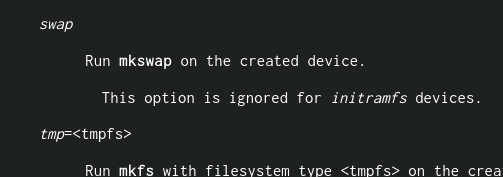

# Personal updates on a bunch of things

A lot of things have happened since the last blog, so I wanted to write about some of those things.

## My personal arch linux repository

I have created an [Arch Linux](https://archlinux.org) repository [here](https://github.com/hecknt/hec-arch-repository). This will contain personal things that I have created or forked, such as my [dmenu build](https://github.com/hecknt/dmenu).  
I have also made a repository specifically for [Artix Linux](https://artixlinux.org) packages [here](https://github.com/hecknt/hec-artix-repository), and I have put up a package both on there and on the [aur](https://aur.archlinux.org) for users who are using runit. This package is on the aur [here](https://aur.archlinux.org/packages/cryptsetup-void-runit), and it's useful for those who use encrypted swap with cryptsetup, since by default the way that /etc/crypttab is handled doesnt allow for encrypted swap to be created on boot. The manpage of crypttab has the swap option literally included in there, along with many other options that arent implemented in artix's runit crypttab.

All of the packages in these repositories are also available in the [aur](https://aur.archlinux.org), so if you don't feel like adding a third-party repository to your pacman.conf, you can just install them from there.

## Youtube and Odysee

I now have both a [YouTube](https://www.youtube.com/channel/UC1KoQ6A0yq7NMFwQf1qMobQ) and an [Odysee](https://odysee.com/$/invite/@Hec_:6) channel. These channels will be talking about personal projects I've been working on, pieces of software, guides, and probably some video games.

## Status on arch-install

arch-install isn't actually going to be finished or released. I have decided that it just isn't worth it to make _yet another arch linux install script_. There are **so many** arch install scripts out there, with many of them being more polished **and** modular than my install script ever could've been.

;date-posted: May 21st, 2021
;date-modified: September 24th, 2021
;date-posted-rss: Saturday, 25 September 2021 03:19:50 +0000
